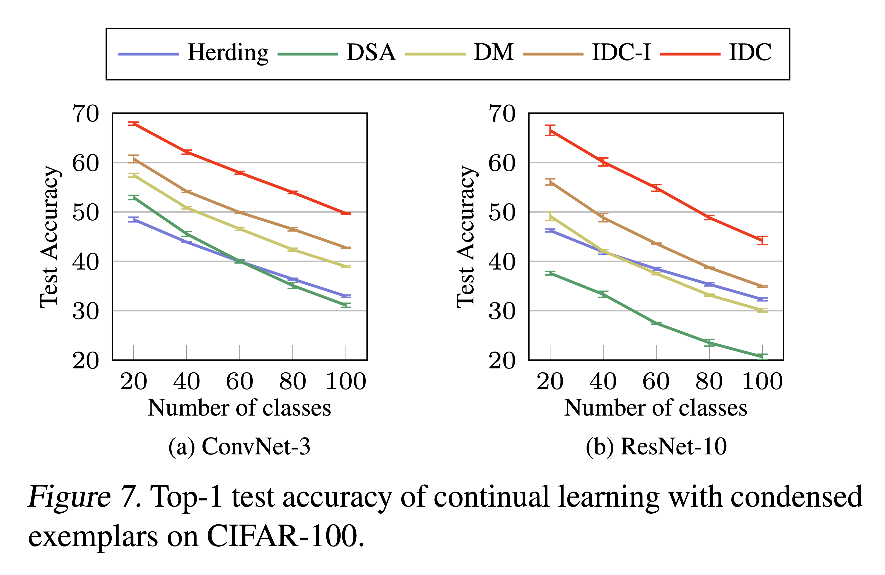

# Class-Incremental Learning with Condensed Data
Reproducible PyTorch code of class incremental continual learning with condensed data. We follow the class incremental setting from [[1]](#1), where the CIFAR-100 dataset is given across 5 steps with a memory budget of 20 images per class. This code builds upon the code provided in [CVPR19_Incremental_Learning](https://github.com/hshustc/CVPR19_Incremental_Learning).

<p align="center">
  
</p>

## Requirements
- Set `--data_dir` in `./argument.py` and `./eval.py` to point the folder containing the original dataset.

- To run the codes, you need
  - Arbitrarily fixed class order of CIFAR-100 dataset.
  - Condensed exemplar data (20 images per class) for each condensation method (*e.g. IDC, DM, DSA, and herding*). Note that data should be synthesized separately for each stage since those are the only ones available in each phase according to the class incremental scenario.

- We provide the class order and condensed data which can reproduce the reult in our paper. For the class order and baseline methods, we bring the same order and data used in [Previous Work](https://drive.google.com/drive/folders/1NEnf_85Hpa2fhztWIxsiDQC1C2w_1YQA).
  - Specifically, we use the class order and baseline data of `5steps_seed0` result from the above link. For the class order, we sort the class order within every 20 classes and locate it at [`./checkpoints/cifar100_order.pkl`](./checkpoints/cifar100_order.pkl) in a pickle form. Since 20 classes are given at each level, reordering within each level is not a problem.

  - For the condensed exemplar data, you can download them from [Here](https://drive.google.com/drive/folders/1Ix0tMYpP3f086JSRT3LG8-CeQwqghasD?usp=sharing). To reproduce the result, locate the data directory as `./data`.

  - To clarify details, baseline exemplar data (DM, DSA, and herding) have labels of the original CIFAR-100 dataset. On the other hand, IDC-I and IDC exemplar data have reordered labels in each phase according to the [given order](./checkpoints/cifar100_order.pkl). This is the reason for the different concatenation strategies in `compute_prototypes()` in [`./exemplar.py`](./exemplar.py).


## How to Train
You can reproduce the result with ConvNet-3 by running the following codes: 
- To train with Herding, run
  ```
  python class_incremental.py --exemplar herding --net convnet
  ```
- To train with DSA (below is the setting with the best performance), run
  ```
  python class_incremental.py --exemplar dsa --train_batch_size 256 --mix_p 0.0 --net convnet
  ```
- To train with DM, run
  ```
  python class_incremental.py --exemplar dm --net convnet
  ```
- To train with IDC-I, run
  ```
  python class_incremental.py --exemplar condense --factor 1 --net convnet
  ```
- To train with IDC, run
  ```
  python class_incremental.py --exemplar condense --factor 2 --net convnet
  ```

You can reproduce the result with ResNet-10 by setting `--net resnet10`. This will create checkpoints for each stages in `./checkpoints`.

## How to Evaluate
You can evaluate the accuracy in each stage for saved checkpoints by running:
```
python eval.py --ckp_prefix checkpoints/cifar100_net_convnet_exemplar_condense_ipc_20_run_0_
```
You may change the `--ckp_prefix` option by any other methods you want to evaluate.

## References
- <a id="1">[1]</a> Zhao, B. and Bilen, H. Dataset condensation with distribution matching. *arXiv preprint arXiv:2110.04181, 2021a.*
