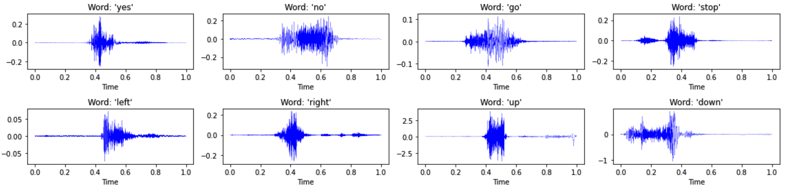

# Mini Speech Commands

#### Condensed speech samples
- You can here our condensed samples from [Here](https://drive.google.com/drive/folders/1LgVwWJcLGr8PfGzGSwWrebTGkP20oP4S?usp=sharing)!


## Requirements
- The code has been tested with PyTorch 1.11.0.   
- To run the codes, install librosa package ```pip install librosa```
- We provide mini speech commands dataset at [Here](https://drive.google.com/file/d/1HABvixB63a-foLRcIdDOjaK5jWjfGxNY/view?usp=sharing). Download and unzip the dataset by ```tar -zxvf mini_speech_commands.tar.gz```. Set ```--data_dir``` in ```argument.py``` to point the folder containing the mini_speech_commands folder. ([reference](https://www.tensorflow.org/tutorials/audio/simple_audio))
- To test with speech data, please move the files to the parent folder by ```mv ./*.py ../``` and go to the parent folder. 

## Test Condensed Data
### Download data
You can download condensed speech data evaluated in our paper from [Here](https://drive.google.com/drive/folders/1yh0Hf2ia4b-1edMiAr1kXCH4eUcYNfmz?usp=sharing).
- To test data, download the entire **speech** folder and locate the folder at ```./results```. 

### Training neural networks on condensed data
Run the following codes:   
```
python test_speech.py -d speech -n convnet -f [factor] --ipc [spectrogram/class] --repeat [#repetition]
```
- Set ```-f 1``` for **IDC-I** and ```-f 2``` for **IDC**.

You can also test other methods by setting ```-s [random, herding]```
- To evaluate Herding, download the pretrained networks for speech ([link](https://drive.google.com/drive/folders/1Sk-IVb7YotbZ07WNJwfp4ID3tv6_MTnx?usp=sharing)) at ```./results```. You can modify the location of the pretrained networks at ```test_speech.py``` (*load_pretrained_herding* fn).


## Optimize Condensed Data
To reproduce our condensed data, run
```
python condense_speech.py --reproduce  -d speech -f [factor] --ipc [spectrogram/class]
```
- The results will be saved at ```./results/[dataset]/[expname]```. 
- We provide specific argument settings for each dataset at ```./misc/reproduce.py```.
- Note, we use a one-dimensional multi-formation along the time-axis in the case of speech data. 
